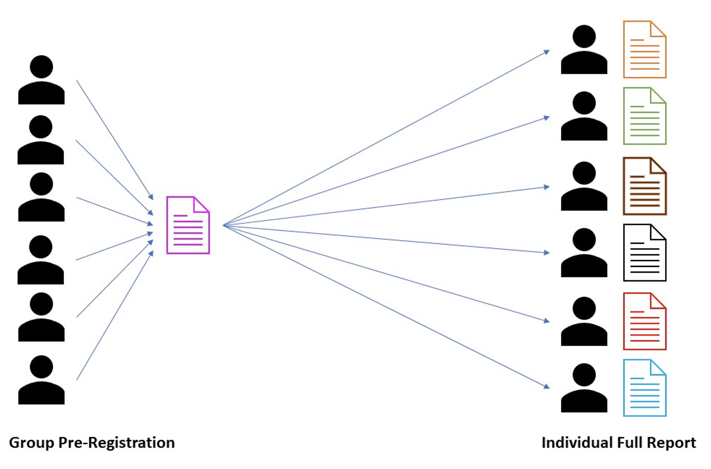
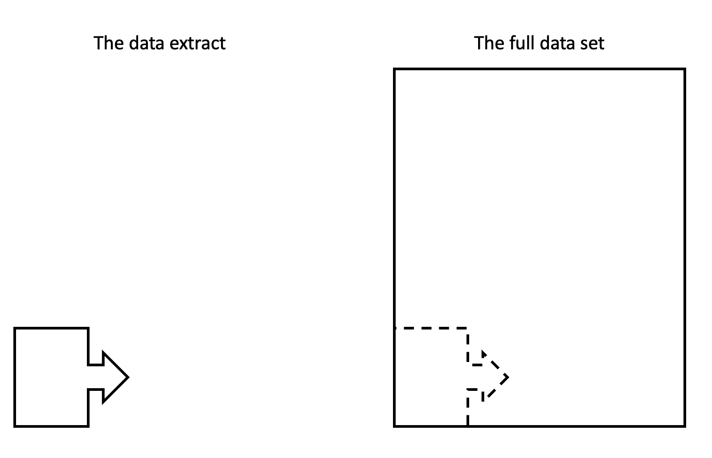

```{r, echo=FALSE}
source(file = "include/deadlines.R")

library(knitr)
```

# Pre-registration guidance {#Prereg-overview}

## Overview and submission details

The two main submissions for this project are:

1. The group pre-registration (1000 word limit, worth 30% of the course)

2. The individual full report (3000 word limit, worth 50% of the course)

These are two individual but connected assignments. You will collaboratively write the pre-registration in groups of 5 or 6 to plan your study. You will then individually write the full report, applying what you planned in the pre-registration. 

```{r prereg figure, fig.alt = "Collaboratively write the pre-registration then individually write the full report", echo=FALSE}

```

In this chapter, we will focus on the pre-registration as the first major assignment of semester 2. The word limit includes all the text within your responses to the five questions at the start of the pre-registration template, including any in-text citations. However, it **does not** include the text of the questions in the template, your reference list, or your analysis code

Please submit the completed .Rmd file, the two data files, and a copy of the knitted Word file. For further details and confirmation of the deadline, please see the **pre-registration AIS** on the Moodle course overview page.

Your marker should be able to download all of the files and reproduce the knitted Word document without any errors. Before you change anything, knit the file to make sure there are no initial errors. Once you have a complete draft, we also recommend making sure another member of your group can knit the document to ensure it is reproducible across different computers.

One member of your group should submit on behalf of the team. After the submission deadline, peer ratings will be available to judge your contribution and the contribution of everyone in your group.

## Group work

Before we outline the role of pre-registration and the template you will complete, it is important to consider group work. Everyone should contribute equally but this does not mean that everyone needs to independently complete every question. If you have not done so already, read the [chapter dedicated to group work](#groupagreement-AIS) where we outline the group work agreement, our expectations around working respectfully and professionally, and task sharing advice. 

You may wish to divide the work:

- By writing/coding

- By question

**Remember though**: Everyone should understand each bit and be able to run and adapt the analysis code as you will need to work individually for the final data analysis and write-up.

## The role of pre-registration

For the development and history behind the rise of pre-registration in psychology, you might want to revisit semester 1 week 2 where we introduced the replication crisis, and week 14 where we looked at past and future developments in the open science movement.

A pre-registration outlines your research design and analysis plan ahead of time. You are writing down your plan for what you are going to do before you collect and/or analyse your data (<a href="https://www.ncbi.nlm.nih.gov/pmc/articles/PMC5856500/" target="_blank">Nosek et al., 2018</a>). As scientists, we want to distinguish between what we planned ahead of time compared to what we decided after seeing the outcome.

When you design your study and consider how you will analyse your data, there are many decisions to make:

-   What do I predict will happen?

-   How many people should I test?

-   Who should I test?

-   Which groups will I compare?

-   What data should I exclude?

-   What do I measure?

-   How do I measure it?

-   What statistical test should I use?

-   What alpha value should I use?

During the replication crisis, psychologists recognised the flexibility in those decisions could - intentionally or unintentionally - produce specific results. It is easy to forget what you originally planned when you analyse the data weeks, months, or even years later, and it is easy to convince yourself that your decision makes sense when the results look like what you were expecting.

So, the aim of pre-registration is to constrain as many of those decisions in advance as possible; the more specific the better (<a href="https://journals.plos.org/plosbiology/article?id=10.1371/journal.pbio.3000937" target="_blank">Bakker et al., 2020</a>). This means after you submit the pre-registration, you can look back and check what you planned to do. If you need to change your plan, then you can transparently explain what changed and why you changed it.

## Deviations from your pre-registration

A pre-registration is your plan - to the best of your knowledge - going into data collection and data analysis. However, like the title of an influential blog post, it is a plan and not a prison (<a href="https://www.cos.io/blog/preregistration-plan-not-prison" target="_blank">DeHaven, 2017</a>). In a study surveying researchers on the perceived costs and benefits, 8.4% mistakenly believed that pre-registration means there is no room for exploratory analyses (<a href="https://www.sciencedirect.com/science/article/pii/S0749597821000649" target="_blank">Logg & Dorison, 2021</a>).

In reality, there is nothing stopping you from changing your plan. When it comes to your final analysis, you may need to change your plan for many reasons:

- Missing data causes an issue;

- Problems with statistical assumptions you did not anticipate;

- You realised your plan was not a good one (<a href="https://bartlettje.github.io/2017-03-29-effective-preregistration/" target="_blank">James wrote</a> about his first attempt at pre-registration which was not great...).

What matters is transparency; pre-registration forces you to outline what you planned from the start and what you changed. There are some components which **should not** change, like your hypotheses. But there are plenty others like your choice of statistical test which can change if you have a rationale for doing so.

## How will the preregistration differ to your final report?

One common question is how the pre-registration and the data you are using will differ to your final report.

In a typical study, you write the pre-registration before collecting data, or the very least before analysing the data. It is your plan for how you will design your study and analyse the data. It can be difficult to imagine and precisely describe the data analysis process without data, so it is normally a good idea to use fake data that is in the same format as your real data. This means you can demonstrate how you will analyse the data based on this fake data. It is **not** there to many any conclusions, you are just using it to demonstrate your plan.

This is what we are trying to recreate in this assignment, but we share a small chunk of the real data for you to use. This means you can see how the data will look and demonstrate the code you will use to process and analyse the data.

```{r prereg data figure, fig.alt = "preregistration data extract vs the full data set", echo=FALSE}

```

Once you get the final real data files, you will be able to replace the preregistration data files and use the same code. It is this point you start making conclusions and thinking whether you addressed your research question and your hypothesis or not. 

::: {.dangerous data-latex=""}
You **do not** need to compare your final results to what you observed in the pre-registration as that was only to demonstrate your plan.
:::

Preparing the data analysis plan and coding means you did a lot of the hard work ahead of time and you only have to check your plan is still a good idea. <a href="https://www.sciencedirect.com/science/article/pii/S0749597821000649" target="_blank">Logg and Dorison (2021)</a> found 79% of researcher agreed pre-registration helps clarify ideas before running a study and 50% agreed it front-loads work in reporting your findings. If there is something you did not consider ahead of time - like not meeting one of the statistical assumptions - then you can edit your code and explain in your report there were deviations from your plan.

## Question guidance

In this section, we have outlined each question you will complete with some points of advice and reference to where you can revise the relevant content from semester 1 and 2. You can download the pre-registration template from the "Project resources for the pre-registration and report" tab of RM1 ODL Moodle. 

::: {.warning data-latex=""}
All sections should be written in coherent paragraphs and not as bullet points or lists. The below is just a guide of the elements that should be covered. Most sections can be supported by citations, so try to include them where you make a decision and where you need evidence.
:::

### 1. Present a concise evidence-based rationale, for the current study, along with your research question and hypothesis.

Be concise. This is not the full introduction to your report, it is a check that you have read a selection of the literature to inform your research question and hypothesis. See semester 1 week 3 and week 4 for types of evidence and using citations. See the [Finding, Reading, and Organising Journal Articles chapter](#Writing-02) for guidance. 

Remember that the rationale is a snapshot of the future introduction. Remember logical flow and the overall structure of a rationale. See semester 2 week 3 on introductions, the rationale, research questions, and hypotheses. The [Structure of the Introduction and Rationale](#intro-rationale) chapter outlines the introduction and different strategies for identifying a rationale. 

Ensure you clearly outline your research question and hypothesis at the end of the rationale. Make sure your hypothesis is fully operationalised.

### 2. Describe the key variables, specifying how they will be measured, how many levels they have (if relevant), and how participants will be assigned (if relevant).

Your approach to this question will depend on whether you are using a correlation and two sub-scales from the MSLQ, or a t-test using one sub-scale and one categorical demographic variable. Think about what information you will need depending on the design you are planning to use. See semester 1 week 1 and 3 for research design terminology and descriptive statistics. The [MSLQ Overview chapter](#MSLQ-overview) defines all the sub-scales and demographic variables you can use. 

For the MSLQ sub-scales, think about:

-   Which sub-scales are you using?

-   How are they calculated (mean/sum)?

-   How many questions do they have?

-   What are the minimum and maximum scores?

-   Are they valid and reliable?

For categorical demographic variables, think about:

-   How many levels does each category have?

-   How are these levels defined, e.g., who is a mature student?

### 3. Describe your precise rule(s) for including and/or excluding observations and/or participants in your study.

There is a subtle difference between inclusion and exclusion criteria. Inclusion criteria are the specific participants you are looking for. Participants must meet the criteria to be included in your study. For example:

-   Are you only interested in postgraduate students?

-   Are you only going to include mature students?

-   Are you looking for a specific age range?

Remember **you** are making these specific decisions. If you are focusing on a specific sample/population, then think about whether this follows logically from your rationale with supporting citations.

Exclusion criteria are applied to the participants that have been included in your study. They meet your inclusion criteria, but you are checking to see if they can be included in the data analysis. For example:

-   Will you exclude people who have missing data? If so, is this the case for any missing data, or only certain variables?

-   Are there any variables where you would consider certain values to be outliers? What happens if one person scores much higher or lower compared to the rest of your sample?

This is probably the first time you have completed a research report like this, so you might not have all the answers at this point. A good thing to do is note any reasons why people were excluded from the papers you were reading and think about if they apply here. This is another area where it is important to justify your decisions with supporting evidence where possible. There are many ways of identifying outliers, so which method did you use and why? Semester 2 week 4 outlines decision making in data analysis and covers concepts like outliers and missing data. 

### 4. Describe exactly which inferential analysis you will conduct to test your hypothesis. Include details of any assumption tests you will conduct.

In this question, you will outline which statistical test will help you best address your research question and hypothesis, given your design. See semester 1 weeks 6-12 on hypothesis testing and statistical tests. Be as specific and precise as you can, considering:

-   What type of correlation/t-test best suits the data you are working with? Pearson, Spearman. Student's between-subjects, Welch's between-subjects, etc.

-   How will you test the assumptions? What will you do if those tests fail? Think about stating the assumptions and how you will test them through visualisations or statistical tests.

-   What alpha value will you use?

-   Would a one- or two-tailed test best address your hypothesis?

Where necessary, justify your decisions with supporting citations. For example, is there a paper that says one test is more appropriate than another?

### 5. Discuss how many observations/participants will be required to detect your smallest effect size of interest, based on your alpha and power. Provide the rationale for your choice of the smallest effect size of interest.

Ultimately, you do not have control over the final sample size because the data already exist; we have been collecting the data successively over the last few years. However, it is important to show you can justify your sample size and inform your decision with a power analysis even when it might be different to the final sample size.

This will be important when it comes to your dissertation and any future research when you could perform a power analysis to justify what sample size you aim for. For this question, your power analysis will solve for "n" - the number of people needed. Once you know the final sample size, you can reflect on your final sample size and the sample size you were aiming for in the pre-registration. 

See semester 1 weeks 6-11 for revising statistical power as a concept and how it applies to correlations and t-tests. Chapter 11 of the data skills book <a href="https://psyteachr.github.io/quant-fun-v2/power-and-effect-sizes.html" target="_blank">Fundamentals of Quantitative Analysis</a> demonstrates how to perform a power analysis using R. Semester 2 week 5 will also specifically address pre-registering a power analysis.

You will need to think about the inputs you use for the power analysis (you might find <a href="https://open.lnu.se/index.php/metapsychology/article/view/3078" target="_blank">Bartlett and Charles (2022)</a> useful for thinking about the decisions you need to make):

-   Alpha

-   Your smallest effect size of interest

-   Power

-   Whether you are using a one- or two-tailed test

You can establish the smallest effect size of interest in numerous ways such as previous studies, a review, or a meta-analysis. We will spend more time on this decision and the process of pre-registering a power analysis in semester 2 week 5. However, it is best not to use the pre-registration data extract to establish an effect size for your final data.

### 6. References

Please provide the reference list for any citations you use in answering the questions above. The reference list should be consistent with APA 7th edition, but note we do not expect details like a hanging indent since its difficult to format in an R Markdown document. For example:

Logg, J. M., & Dorison, C. A. (2021). Pre-registration: Weighing costs and benefits for researchers. *Organizational Behavior and Human Decision Processes, 167*, 18-27. https://doi.org/10.1016/j.obhdp.2021.05.006

### 7. Analysis code

The completed .Rmd file for the pre-registration should contain your analysis code in R using the pre-registration data extract we supplied.

The final data set will be in the same format so you can reuse the code. Analysing the mock data allows you to visualise what the final data might look like and helps you recognise the decisions you will need to make.

You may not be able to prepare all of the code now, but you can do most of the wrangling, processing, and planned statistical tests. For example, you might not be able to prepare the code to remove everyone based on a given criterion just yet as it might not apply to the data extract and only the full data will allow that, but you can definitely make a start on all of the sections.

## Coding guidance 

On the RM1 ODL Moodle page, you will see the "Project resources for the pre-registration and report" tab. Under "Pre-registration Resources", you can access the pre-registration template .Rmd file and the small data extract.

At the end of the pre-registration template .Rmd file, there are 12 prompts for what steps to complete when processing the data, and adding your visualisations and analyses. Some prompts contain complete code chunks to run, some contain code chunks to edit, while others are completely blank. This is where you will put your all your data skills into practice, such as data wrangling, visualisation, and descriptive and inferential statistics. 

The .Rmd file contains brief explanations and prompts, but here we are reinforcing what skills go into each component and highlighting relevant content from the Quantitative Fundamentals data skills book. 

### 1. Load in packages and data. 

The first code chunks provides a starting point to working with the data. It loads `tidyverse` and reads in both of the data sets you will be working with. It is normally good practice to load all the packages you need at the start of the script, so if you need packages for later steps, add them into this code chunk rather than dispersing them throughout the script. 

**Key data skills**: 

- Chapter 3 - Starting with data. 

### 2. Clean up the data

The code chunk here should be run without edits, assuming the data you read in have the original object names. The code here will clean up the Experimentum data a little bit to help you on your way. Its taken from the [Experimentum manual](https://debruine.github.io/experimentum/data.html) to retain only the first time any participant completes the study. Without it, you can encounter various problems in later steps if there are duplicate user IDs, so please make sure you run this chunk. 

::: {.info data-latex=""}
While you do not need to edit this code chunk, read over it and work out what it is doing. You will recognise all the data wrangling functions, so identify what each line is doing to the raw data files. 
:::

**Key data skills**: 

- Chapter 4 - Data wrangling 1.

- Chapter 5 - Data wrangling 2.

- Chapter 6 - Data wrangling 3.

### 3. Join together the data files by their common columns

We provide the data as two separate files: one for demographics and one for the MSLQ questions. For further processing and analysis, you will want all of this information in one data frame. The code chunk is blank, so add in code to join the two data files by all their common columns. 

**Key data skills**: 

- Chapter 3 - Starting with data. 

- Chapter 4 - Data wrangling 1.

- Chapter 5 - Data wrangling 2.

- Chapter 6 - Data wrangling 3.

### 4. Use select to retain only the variables you need for your analysis 

At the moment, you will have many variables for all the demographics and all the MSLQ questions. You will not need all of the variables, so it will make it easier to work with if you just retain the ones you need. For example, the user_id, any demographic variables to use or report, and the MSLQ items you need for your specific project. 

**Key data skills**: 

- Chapter 4 - Data wrangling 1.

- Chapter 5 - Data wrangling 2.

- Chapter 6 - Data wrangling 3.

### 5. If necessary, use `filter()` to retain only the observations you need. 

This is where you would think about your inclusion and/or exclusion criteria. Do you plan on only including participants with certain characteristics in your study? For example, you might need to remove participants above a certain age, or only use mature students etc. If you do not need to filter things then leave this section blank or delete it. 

::: {.info data-latex=""}
Its normally a good idea to report how many participants you start with, and how many you exclude, to leave your final sample size you work with. This is not relevant to the pre-registration, but you will need it for the final report and full data set. So, if you plan on excluding people at this stage, think about how you would record the sample size at each stage. 
:::

**Key data skills**: 

- Chapter 4 - Data wrangling 1.

- Chapter 5 - Data wrangling 2.

- Chapter 6 - Data wrangling 3.

### 6. Explore the data to check what "type" each variable is 

At this point, you are getting close to applying the analysis steps for your data. Now, it would be a good time for some exploratory data analysis to understand what your data look like. For example, checking the variables to see whether they are a character, numeric, etc. Think about functions like `summary()`, `str()`, and `glimpse()` to check out each variable. Recode any necessary variables as factors and, if you would like to, change numeric codes (e.g., 1 for native speaker) into words to make it easier to read the output and make appropriate visualisations. You might also create some quick exploratory data analysis plots like histograms to check out the properties of your data. 

**Key data skills**: 

- Chapter 3 - Starting with data. 

- Chapter 4 - Data wrangling 1.

- Chapter 5 - Data wrangling 2.

- Chapter 6 - Data wrangling 3.

- Chapter 7 - Intro to data visualisation. 

### 7. Calculate the mean score for each participant for each sub-scale. 

There are two code chunks here and they provide a starting point for you to edit. One is intended for those working with different groups/a t-test, and the other is intended for those working with relationships/correlations. The code chunks take the MSLQ items and calculates a subscale score.

There are a few ways you can do this but the Experimentum documentation provides example code to make this easier. For now, you have to adapt the code for the variables you need - changing only a few names to make it work for your data. You may also want to change the `na.rm = TRUE` for the calculation of means depending on whether you want to only include participants who completed all questions.

::: {.warning data-latex=""}
There are two code chunks here, but you only need **one**. You will be able to run the code, but if you try and knit the file, you might get an error for the code chunks after this section. This is because at the top of the code chunk you are using, you must change `eval = FALSE` to `eval = TRUE` once you have amended your code. The reason it is currently set to FALSE is to allow the file to knit without your edits. `eval = FALSE` says ignore the code chunk. `eval = TRUE` says run the code chunk. So, when it comes to the code chunks after this, it would not have run the code and the object would not exist. So, make sure you edit the code chunk you need for your analysis. 
:::

**Key data skills**: 

- Chapter 3 - Starting with data. 

- Chapter 4 - Data wrangling 1.

- Chapter 5 - Data wrangling 2.

- Chapter 6 - Data wrangling 3.

### 8. Check assumptions

You should now have the data set in the format that you need for analysis. Now you should check that the data meets the assumptions of the tests you want to conduct. This will be, depending on analysis, aspects such as normality, linearity, homoscedasticity, etc.

::: {.info data-latex=""}
Remember assumption checks are often a grey judgement call, there might not be a black and white decision. Many of the checks rely on visualisations and your interpretation, so it is about being able to rationalise and justify your decision to the reader. 
:::

**Key data skills**: 

- Chapter 9 - Correlations.

- Chapter 10 - t-tests.

- Chapter 12 - Screening data.

### 9. Data visualisation

Next, you should visualise the data for each analysis with your reader in mind. For a t-test you might want to visualise the data through a violin-boxplot. For a correlation, you would be looking for a scatterplot. Refer back to semester 1 week 4 for data visualisation principles, then the relevant analysis chapters for formatting suitable plot types for your design. 

**Key data skills**: 

- Chapter 7 - Intro to data visualisation.

- Chapter 9 - Correlations.

- Chapter 10 - t-tests.

### 10. Calculate descriptive statistics

You may have already obtained some useful descriptive statistics from previous sections, but if not, or there are additional ones you want to include, calculate them here. This might include means, standard deviations, the sample size for various groups etc. If you already have the relevant information, then leave this blank.

::: {.info data-latex=""}
Remember to consider what descriptive statistics are appropriate for the data and assumptions you are working with. Would the mean and standard deviation be best, or the median and interquartile range? 
:::

**Key data skills**: 

- Chapter 4 - Data wrangling 1.

- Chapter 5 - Data wrangling 2.

- Chapter 6 - Data wrangling 3.

- Chapter 9 - Correlations.

- Chapter 10 - t-tests.

### 11. Statistical power

You do not have control over the final sample size, but it is important to demonstrate you can calculate how many participants you would need to detect your Smallest Effect Size of Interest (SESOI) for an *a priori* power analysis. When you have the full data set, you can adapt the code to establish what effect size your final sample size was sensitive to detect for a *sensitivity* power analysis.

**Key data skills**: 

- Chapter 9 - Correlations.

- Chapter 10 - t-tests.

- Chapter 11 - Power and effect sizes. 

### 12. Inferential statistics

Finally, you can conduct your inferential statistical analysis. Remember the three key components of inferential statistics: null hypothesis significance testing, effect size, and a confidence interval. Think about what statistical test will address your research question and hypothesis, given the design. 

**Key data skills**: 

- Chapter 9 - Correlations.

- Chapter 10 - t-tests.

- Chapter 11 - Power and effect sizes. 

## Preregistration examples

As a final reference point, you might find it useful to look at examples of pre-registrations to see how they are framed. Just keep in mind there are different pre-registration templates. Some are shorter, while others are longer. Remember this is an assessment, so they might include additional sections we have not asked you to include, so make sure you follow the template we provide.

**Note**: These examples are not meant to provide a gold standard of what to aim for. Their writing style, presentation, and content might be different to guidance we have provided throughout this course. We just think it is useful to see different examples of a pre-registration and use them to reflect on your own work.

1.  Moeller and Paterson (2019): <a href="https://doi.org/10.17605/OSF.IO/XTK9Q" target="_blank">In the face of intellectual disability</a>.

2.  Palmer and Bartlett (2019): <a href="https://osf.io/dg7w5?view_only=None" target="_blank">Faith Impaired Perceptions of Self-Forgiveness</a>.

3.  Zulkefli, Tulloch, and Bartlett (2022): <a href="https://osf.io/t645q" target="_blank">Emotion Regulation and Socioeconomic Status : A Cross-Cultural Replication Study</a>.
